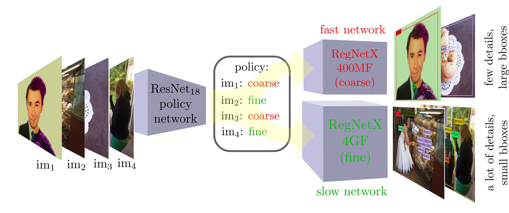

# EfficientObjectDetection

Our code and experiments around the paper [https://arxiv.org/abs/1912.03966](https://arxiv.org/abs/1912.03966). We consider a simplified version of the framework presented in the paper. In particular, we train only one `policy network` which distinguish between images which need to be elaborated with a *large* and *accurate* detector and images which is sufficient to be processed with a *small* and *coarse* detector. In our experiments we deal with **COCO** image detection dataset and don't split images into patches. Our overall inference procedure is presented in the image

## Requirements

* `mmdetection` framework. For the installation instruction see the [original documentation](https://github.com/open-mmlab/mmdetection/blob/master/docs/get_started.md)

* **COCO** dataset. The dataset details and distributed files could be found on the official [website](https://cocodataset.org/)

To perform the inference one need to use the *coarse* and *fine* level detectors form `mmdetection`. The links to the corresponding configs as well as checkpoints are available in the table below

| **network**       | link to the config                                                                                                                                 | link to checkpoint                                                                                                                                                                                               |
|-------------------|----------------------------------------------------------------------------------------------------------------------------------------------------|------------------------------------------------------------------------------------------------------------------------------------------------------------------------------------------------------------------|
| RegNetX-4GF-FPN   | [fine level config](https://github.com/open-mmlab/mmdetection/blob/master/configs/regnet/cascade_mask_rcnn_regnetx-4GF_fpn_mstrain_3x_coco.py)     | [fine model checkpoint](https://download.openmmlab.com/mmdetection/v2.0/regnet/mask_rcnn_regnetx-4GF_fpn_mstrain-poly_3x_coco/mask_rcnn_regnetx-4GF_fpn_mstrain-poly_3x_coco_20210602_032621-00f0331c.pth)       |
| RegNetX-400MF-FPN | [coarse level config](https://github.com/open-mmlab/mmdetection/blob/master/configs/regnet/cascade_mask_rcnn_regnetx-400MF_fpn_mstrain_3x_coco.py) | [coarse model checkpoint](https://download.openmmlab.com/mmdetection/v2.0/regnet/mask_rcnn_regnetx-400MF_fpn_mstrain-poly_3x_coco/mask_rcnn_regnetx-400MF_fpn_mstrain-poly_3x_coco_20210601_235443-8aac57a4.pth) |

The checkpoints of our ResNet18 `policy network` will be available soon

## Inference

The demo of the inference is available in `./inference_demo.ipynb` notebook. One need to set up all necessary pathes to datasets, checkpoints and configs and substitute demo agent with trained ResNet18 `policy network`.

## Credits

* Original [code](https://github.com/uzkent/EfficientObjectDetection) by the authors of [https://arxiv.org/abs/1912.03966](https://arxiv.org/abs/1912.03966)

* Celebrated [mmdetection](https://github.com/open-mmlab/mmdetection) framework